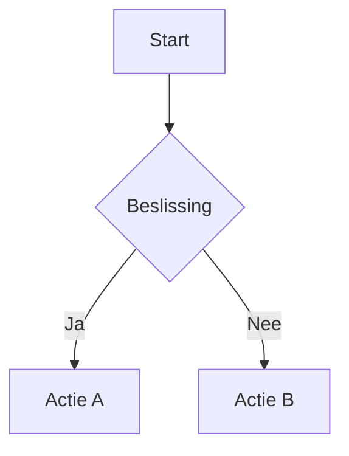

# ZORGI PHARMA - Project Conventies

**Versie:** 2.3  
**Laatst bijgewerkt:** 19/03/2026

**Doel:** Gedeelde afspraken en conventies voor alle ZORGI PHARMA-projecten  
**Type:** Convention  
**Auteur:** Danny Depecker
**Status:** Approved

**Bestandsnaam:** project-conventies.instructions.md  
**Path:** .github/instructions/

---

## Inhoudsopgave

1. [Relatie tot Style Guide](#1-relatie-tot-style-guide)
2. [Taal en Communicatie](#2-taal-en-communicatie)
3. [Bestandsnamen en Datumnotatie](#3-bestandsnamen-en-datumnotatie)
4. [Document Header en Metadata](#4-document-header-en-metadata)
5. [Visuele Hiërarchie en Stijl](#5-visuele-hiërarchie-en-stijl)
6. [Code Conventies](#6-code-conventies)
7. [Diagrammen en Visualisaties](#7-diagrammen-en-visualisaties)
8. [Navigatie en Traceerbaarheid](#8-navigatie-en-traceerbaarheid)
9. [Prompt Frameworks](#9-prompt-frameworks)
10. [Afkortingen](#10-afkortingen)
11. [T-shirt schattingen](#11-t-shirt-schattingen)
12. [Branding & productnamen](#12-branding--productnamen)

---

## 1. Relatie tot Style Guide

Deze conventies zijn een **aanvulling op** — niet een vervanging van — de generieke
`md-style-guide.md`. De hiërarchie is als volgt:

| Niveau    | Bestand                   | Doel                                             |
| --------- | ------------------------- | ------------------------------------------------ |
| Generiek  | `md-style-guide.md`       | Universele markdown- en opmaakregels             |
| Project   | `project-conventies.md`   | ZORGI PHARMA-specifieke afspraken (dit document) |
| Instantie | `copilot-instructions.md` | CSAT-Compass specifieke GHC-instructies          |

Bij conflict tussen niveaus geldt: **project-conventies > style guide** voor ZORGI PHARMA-projecten.

---

## 2. Taal en Communicatie

- **Documentatie:** Nederlands — alle markdown-bestanden, README's, commentaren en docstrings
- **Code-entiteiten:** Engels — variabelen, functies, klassen, SQL-tabellen, kolomnamen
- **Technische termen:** Engels waar Nederlands onnatuurlijk klinkt
  - Voorbeelden: *commit*, *repository*, *pull request*, *merge*, *branch*
- **Doel:** Uniformiteit waarborgen over alle ZORGI PHARMA-projecten

---

## 3. Bestandsnamen en Datumnotatie

### 3.1 Bestandsnamen

- **Kebab-case:** Altijd lowercase met hyphens — geen underscores, geen spaties
  - ✅ Correct: `operations-runbook.md`, `fase1-omgevingsinrichting.md`
  - ❌ Fout: `Operations_Runbook.md`, `Fase1 Omgevingsinrichting.md`
- **Meta-bestanden:** UPPERCASE voor speciale projectbestanden
  - `README.md`, `CHANGELOG.md`, `LICENSE.md`, `CONTRIBUTING.md`

### 3.2 Datumnotatie

| Context                      | Formaat      | Voorbeeld                                     |
| ---------------------------- | ------------ | --------------------------------------------- |
| In tekst en document headers | `DD/MM/YYYY` | `17/03/2026`                                  |
| In bestandsnamen             | `YYYY-MM-DD` | `2026-03-17-meeting-notes.md`                 |
| In archief-bestandsnamen     | `YYYYMMDD`   | `implementatie-gids-ARCHIEF-v3.0-20260317.md` |

**Rationale bestandsnamen:** ISO-formaat sorteert chronologisch in Bestandsverkenner en PyCharm.

---

## 4. Document Header en Metadata

### 4.1 Verplichte Header

Elk markdown-document volgt de verplichte header uit `md-style-guide.md` sectie 1.
Projectspecifieke aanvulling: de H1-titel volgt altijd het patroon:

```text
# [PROJECTNAAM] - [Document Titel]
```

Voorbeelden: `# CSAT - Maandrapportage Januari 2026`, `# Scriptorium - ADR-003: DBHub Keuze`

### 4.2 Auteur Veld — ZORGI PHARMA Standaard

Het **Auteur** veld registreert transparant wie of wat het document heeft opgesteld.
AI-tools zijn volwaardige auteurs binnen ZORGI PHARMA-projecten.

| Situatie              | Waarde                    |
| --------------------- | ------------------------- |
| Menselijke auteur     | `Danny Depecker`          |
| GitHub Copilot        | `GHC`                     |
| Claude (Anthropic)    | `Claude`                  |
| Gemini (Google)       | `Gemini`                  |
| Mens + GitHub Copilot | `Danny Depecker + GHC`    |
| Mens + Claude         | `Danny Depecker + Claude` |
| Meerdere AI-tools     | `GHC + Claude`            |

### 4.3 Versiehistorie

**Elk document eindigt met een versiehistorie tabel** — geen uitzonderingen.

```markdown
## Versiehistorie

| Versie | Datum      | Wijzigingen     | Auteur         |
| ------ | ---------- | --------------- | -------------- |
| 1.0    | 17/03/2026 | Initiële versie | Danny Depecker |
```

**Opmaakregel:** Geen bold-formatting (`**tekst**`) in tabelcellen van de versiehistorie.

---

## 5. Visuele Hiërarchie en Stijl

### 5.1 Emoji Gebruik

Gebruik emoji als **visuele ankers** voor snelle oriëntatie in documenten.

> ⚠️ **Gebruik altijd de codepoints uit onderstaande tabel.** Visueel identieke emoji
> kunnen uit verschillende Unicode-blokken komen en anders renderen in PDF.
> Voorbeeld: ➡️ (U+27A1 Dingbats) vs ➡️ (U+2B95 Arrows) — zelfde uiterlijk,
> ander font-blok, inconsistent gewicht in PDF. Gebruik altijd U+2B95.

#### 5.1a Statusemoji

| Emoji | Unicode | Betekenis             | Gebruik                      |
| ----- | ------- | --------------------- | ---------------------------- |
| ⚠️    | U+26A0  | Risico / Waarschuwing | Kritieke aandachtspunten     |
| ✅     | U+2705  | Voltooid / Correct    | Bevestiging, good practices  |
| ❌     | U+274C  | Fout / Incorrect      | Fouten, don'ts               |
| 🚀     | U+1F680 | Release / Go-live     | Mijlpalen, deployments       |
| 💡     | U+1F4A1 | Idee / Tip            | Suggesties, hints            |
| 🎯     | U+1F3AF | Focus / Doel          | Prioriteiten, doelstellingen |
| 🔍     | U+1F50D | Analyse / Onderzoek   | Bevindingen, inspecties      |
| 🔄     | U+1F504 | In progress           | Work in progress secties     |
| ⏳     | U+23F3  | Gepland               | Nog te implementeren         |
| 📋     | U+1F4CB | Checklist / Overzicht | Lijsten, samenvattingen      |

#### 5.1b Projectemoji CSAT-Compass

| Emoji | Unicode   | Betekenis              | Gebruik                          |
| ----- | --------- | ---------------------- | -------------------------------- |
| 🧭    | U+1F9ED   | Kompas — project anker | H1 titels, rapporten, branding   |

#### 5.1c Richtingspijlen (pijler-kompasmetafoor)

Gebruik uitsluitend pijlen uit het **Arrows-blok** (U+2190–U+21FF) —
alle 4 renderen consistent in PDF met identiek font en gewicht:

| Emoji | Unicode | Richting | Pijler     |
| ----- | ------- | -------- | ---------- |
| ↑     | U+2191  | Noord    | PHARMA     |
| →     | U+2192  | Oost     | CARE       |
| ↓     | U+2193  | Zuid     | ERP4HC     |
| ←     | U+2190  | West     | CARE ADMIN |

> ❌ **Niet gebruiken:** ⬆️ U+2B06 / ⬇️ U+2B07 / ⬅️ U+2B05 / ➡️ U+27A1 of U+2B95
> — komen uit verschillende Unicode-blokken en renderen inconsistent in PDF.

### 5.2 Headers

- Alleen het **eerste woord** van een header krijgt een hoofdletter (Nederlandse conventie)
  - ✅ Correct: `## Algemene richtlijnen`
  - ❌ Fout: `## Algemene Richtlijnen`
- Uitzondering: eigennamen, afkortingen en productnamen behouden hun schrijfwijze
  - ✅ Correct: `## DBHub configuratie`, `## CSAT rapportage`

### 5.3 Lijsten

- Ongeordende lijsten: altijd `-` als bullet (geen `*` of `+`)
- Geordende lijsten: nummering start altijd bij `1`
- Maximale diepte: 3 niveaus

---

## 6. Code Conventies

### 6.1 Code Block Formatting

Wanneer GHC code aanlevert ter modificatie of review, geldt **altijd** dit formaat:

1. **Taalspecificatie:** `bash` (ongeacht de werkelijke programmeertaal)
2. **Eerste regel:** absoluut bestandspad voorafgegaan door `#` en één spatie
3. **Tweede regel:** volledig leeg
4. **Vanaf regel 3:** volledige, uitvoerbare code zonder omissies

```bash
# C:\Users\danndepe\Documents\AI\[PROJECT]\code\script.py

[volledige code hier]
```

### 6.2 Commentaren en Docstrings

- **Inline commentaren:** Nederlands
- **Docstrings** (Python `"""..."""`): Nederlands
- **Variabele- en functienamen:** Engels

### 6.3 Veelgebruikte Talen per Project

| Taal         | Code Block Tag | Primair gebruik                      |
| ------------ | -------------- | ------------------------------------ |
| Python       | `python`       | Analyse, rapportage, automatisering  |
| PowerShell   | `powershell`   | Windows scripting, hulptools         |
| SQL          | `sql`          | Databasequeries, validatie           |
| Bash         | `bash`         | Code block formatting (zie 6.1)      |
| Mermaid      | `mermaid`      | Diagrammen en planningsvisualisaties |
| Tekst/Output | `text`         | Verwachte terminal output            |

---

## 7. Diagrammen en Visualisaties

### 7.1 Mermaid als standaard

Gebruik **Mermaid** voor alle diagrammen die in versiebeheer worden beheerd.
Voordeel: tekst-gebaseerd = diffbaar, geen externe afbeeldingsbestanden nodig.



### 7.2 Aanbevolen Diagramtypes per Situatie

| Situatie                        | Mermaid Type            |
| ------------------------------- | ----------------------- |
| Projectplanning en fasering     | `gantt`                 |
| Procesflows en beslisbomen      | `graph TD` / `graph LR` |
| Systeeminteracties en API-calls | `sequenceDiagram`       |
| Databaseschema's                | `erDiagram`             |
| Statusovergangen                | `stateDiagram-v2`       |

### 7.3 Richtlijnen

- Geef elk diagram een beschrijvende `title`
- Voeg een korte omschrijving toe **boven** het codeblok
- Gebruik Mermaid in voorkeur boven statische PNG-afbeeldingen

---

## 8. Navigatie en Traceerbaarheid

### 8.1 Relatieve Links

Gebruik **altijd relatieve paden** voor interne documentlinks — er is geen centrale Wiki:

```markdown
[Zie fase 1](docs/02-tactisch/fasen/fase1-omgevingsinrichting.md)
[Troubleshooting](#troubleshooting)
[Architectuur beslissingen](../architectuur-beslissingen.md)
```

### 8.2 Archief Traceerbaarheid

Bij verplaatsing van een document naar `archive/` blijven **Bestandsnaam** en **Path**
in de document header ongewijzigd. Ze tonen de originele locatie voor traceerbaarheid.

### 8.3 Verbanden Leggen

Documenteer altijd de relatie tussen:

- Strategische keuzes (ADR's in `docs/01-strategisch/`)
- Tactische uitvoering (fasen in `docs/02-tactisch/`)
- Operationele procedures (`docs/03-operationeel/`)

---

## 9. Prompt Frameworks

ZORGI PHARMA-projecten werken met gestructureerde prompt-kaders voor AI-interacties.
Dit verhoogt consistentie en herbruikbaarheid van prompts over projecten heen.

### 9.1 CREATE Framework

| Letter | Element               | Beschrijving                                            |
| ------ | --------------------- | ------------------------------------------------------- |
| **C**  | Context               | Projectcontext en doelstelling meegeven                 |
| **R**  | Role                  | Rol van de AI definiëren (bv. data-analist, rapporteur) |
| **E**  | Explicit instructions | Concrete taakomschrijving                               |
| **A**  | Audience              | Doelpubliek van de output (leadership, team, klant)     |
| **T**  | Tone                  | Gewenste toon (professioneel, analytisch, bondig)       |
| **E**  | Examples              | Voorbeeldoutput of referentiedocument meegeven          |

### 9.2 CARE Framework

| Letter | Element | Beschrijving                           |
| ------ | ------- | -------------------------------------- |
| **C**  | Context | Situatieschets en achtergrond          |
| **A**  | Action  | Gewenste actie of taak                 |
| **R**  | Result  | Verwachte uitkomst of format           |
| **E**  | Example | Concreet voorbeeld ter verduidelijking |

### 9.3 Wanneer Welk Framework

| Situatie                         | Framework      |
| -------------------------------- | -------------- |
| Complexe analyse met doelpubliek | CREATE         |
| Gerichte taakuitvoering          | CARE           |
| Rapportage voor leadership       | CREATE         |
| Codewijziging of debugging       | CARE           |
| Documentatie genereren           | CREATE of CARE |

---

## 10. Afkortingen

Gebruik de volgende afkortingen consistent over alle ZORGI PHARMA-projecten:

| Afkorting | Voluit                              | Toelichting                              |
| --------- | ----------------------------------- | ---------------------------------------- |
| GHC       | GitHub Copilot                      | AI-coding assistent in PyCharm           |
| GHD       | GitHub Desktop                      | GUI-client voor Git-operaties op Windows |
| PC2025    | PyCharm 2025.x                      | Primaire IDE                             |
| ADR       | Architecture Decision Record        | Architectuurbeslissing                   |
| NVT       | Niet Van Toepassing                 | Leeg verplicht veld                      |
| TBD       | To Be Defined                       | Nog in te vullen veld                    |
| PII       | Personally Identifiable Information | Persoonsgegevens                         |

---

## 11. T-shirt schattingen

ZORGI PHARMA-projecten gebruiken **T-shirt sizing** voor het inschatten van
inspanning op fase-, feature- of taakniveau. De schaal combineert een
**uurbandbreedte** (concrete indicatie) met een **relatief gewicht t.o.v. XS**
(comparatieve maat voor complexiteit).

### 11.1 Schaal

| Maat  | Uurbandbreedte | Gewicht (t.o.v. XS) | Typisch gebruik                                       |
| ----- | -------------- | ------------------- | ----------------------------------------------------- |
| XS    | 1–4u           | 1×                  | Kleine aanpassing, bugfix, config-wijziging           |
| S     | 4–8u           | 2×                  | Eenvoudige feature, bouwt op bestaande infrastructuur |
| M     | 8–24u          | 5×                  | Nieuwe module of systeem, meerdere bestanden          |
| L     | 24–48u         | 10×                 | Complexe feature, meerdere afhankelijkheden, UX-werk  |
| XL    | 48–80u         | 20×                 | Grote deeloplossing, cross-module impact              |
| XXL   | 80–120u        | 30×                 | Volledige fase of subsysteem                          |
| XXXL  | >120u          | >40×                | Heel project of meerdere fasen gecombineerd           |

### 11.2 Gedragsregels voor GHC

- Gebruik T-shirt sizing wanneer gevraagd wordt om een inschatting van werk
- Geef **altijd een toelichting** bij de keuze (1 zin per fase/item)
- Geef bij een totaalbereik ook de **combinatiemaat** aan (bv. M+M+S = XXL)
- Gebruik de schaal ook in implementatiegidsen en faseoverzichten
- Verwijs naar deze tabel als referentie: `project-conventies.instructions.md § 11`

### 11.3 Voorbeeld

| Item                    | T-shirt | Uurbandbreedte | Redenering                                     |
| ----------------------- | ------- | -------------- | ---------------------------------------------- |
| Hybride loader opzetten | M       | 8–24u          | Nieuw systeem, 3 bestanden, unit tests vereist |
| Extra pijler toevoegen  | S       | 4–8u           | Kopie van bestaande pijler + config aanpassen  |
| Streamlit dashboard     | L       | 24–48u         | UX, filtering, charts, tweetaligheid           |

---

## 12. Branding & productnamen

> Volledig referentiedocument: `.github/docs/zorgi-design-system.md`  
> Brandingvragen: <marcom@zorgi.be>

### 12.1 Productnamen — verplichte schrijfwijze

Gebruik **altijd** deze exacte schrijfwijzen in alle documenten, code-commentaren, rapporten en gegenereerde output:

| Product            | Correcte spelling | Fout |
|--------------------| ----------------- | ---- |
| Bedrijfsnaam       | ZORGI | Zorgi / zorgi |
| Care-product       | CARE | Care / care |
| Care Admin-product | OAZIS | Oazis / oazis |
| Pharma-product     | ZORGI PHARMA | Zorgi Pharma / ZORGI pharma |
| ERP-product        | ERP4HC²·⁰ | ERP4HC / erp4hc |

> Uitzondering: "Zorgi" (kleine letter) is alleen correct bij verwijzing naar de Esperanto-woordoorsprong.

### 12.2 Kleuren — referentie

| Variabele | HEX | Gebruik |
| --------- | --- | ------- |
| `--zorgi-dark-blue` | `#003a70` | Primaire kleur, H1, H4, donkere achtergronden |
| `--zorgi-red` | `#dc2b26` | Accent, gradient einde, highlights |
| `--zorgi-purple` | `#7f4267` | Gradient midden, titelbalken |
| `--zorgi-grey-blue` | `#5f8495` | H2, secundaire tekst |
| `--zorgi-light-blue` | `#609fce` | H3, H5, accenten |
| `--zorgi-ultra-light-blue` | `#d7e7f3` | Achtergronden, kaarten, containers |

Gradient: `linear-gradient(to right, #003a70, #7f4267, #dc2b26)`

### 12.3 Tone of voice

- **Externe rapporten:** formeel "u"
- **Interne documenten:** informeel "je"
- Toon is altijd: empathisch, oplossingsgericht, transparant, persoonlijk

### 12.4 Schrijftips — eenvoudige taal

| Niet gebruiken | Gebruik in de plaats |
| -------------- | -------------------- |
| Met betrekking tot / In verband met | Over |
| Aan de hand van | Met |
| Met uitzondering van | Behalve |
| In geval dat | Als |
| In overeenstemming met | Volgens |

### 12.5 Design checklist voor GHC

Bij elke branded output (rapport, dashboard, visualisatie) verifiëren:

- [ ] ZORGI geschreven in HOOFDLETTERS
- [ ] Productnamen conform tabel 12.1
- [ ] Uitsluitend brandkleuren gebruikt (zie 12.2)
- [ ] Poppins / Verdana als fallback
- [ ] Afgeronde hoeken (`border-radius: 16px` standaard)
- [ ] Gradient loopt Dark Blue → Purple → Red
- [ ] Toon is empathisch en oplossingsgericht
- [ ] Eenvoudige taal (zie 12.4)

---

## Versiehistorie

| Versie | Datum | Wijzigingen | Auteur |
| ------ | ---------- | ------------------------------------------------------------------------------------------------------------------------------- | ----------------------- |
| 1.0 | 01/01/2026 | Initiële versie | Danny Depecker |
| 2.0 | 17/03/2026 | Volledige herziening: document header, frontmatter, auteur-conventies, code conventies, Mermaid, prompt frameworks, afkortingen | Danny Depecker + Claude |
| 2.1 | 19/03/2026 | Sectie 11 toegevoegd: T-shirt schattingen met schaal, GHC-gedragsregels en voorbeeld | Danny Depecker + GHC |
| 2.2 | 19/03/2026 | Sectie 11 herzien: Punten vervangen door uurbandbreedte + gewicht t.o.v. XS | Danny Depecker + GHC |
| 2.3 | 19/03/2026 | Sectie 12 toegevoegd: Branding & productnamen op basis van zorgi-design-system.md | Danny Depecker + GHC |
