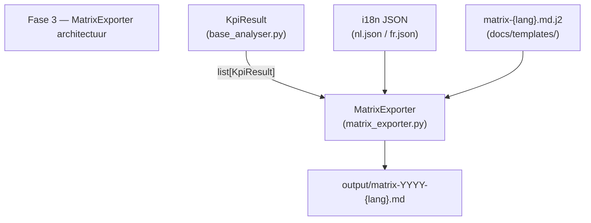

# CSAT-Compass - Fase 3a: MatrixExporter

**Versie:** 1.0  
**Laatst bijgewerkt:** 23/03/2026  

**Doel:** Implementatiebeschrijving van de MatrixExporter — vergelijkingsmatrices per pijler over meerdere periodes  
**Type:** Implementatie  
**Auteur:** Danny Depecker + GHC  
**Status:** In Progress  

**Bestandsnaam:** fase3a-matrix.md  
**Path:** docs/02-tactisch/fasen/

> Vorige fase: [fase2-rapportage.md](fase2-rapportage.md)  
> Volgende fase: [fase3b-evolutie-analyser.md](fase3b-evolutie-analyser.md)  
> Architectuurbeslissingen: [architectuur-beslissingen.md](../../01-strategisch/architectuur-beslissingen.md)

---

## 1. Doelstelling

Fase 3 voegt een `MatrixExporter` toe die vergelijkingsmatrices genereert over **meerdere periodes tegelijk** — ter aanvulling op de maandrapportage uit Fase 2 (die één periode toont). Doel: trends en uitschieters in één oogopslag tonen aan leadership (CEO, COO).

**T-shirt:** S (4–8u) — bouwt volledig op Fase 2-infrastructuur (Jinja2, i18n, KpiResult).

---

## 2. Deliverables

| Component | Bestand | Status |
|---|---|---|
| MatrixExporter | `src/csat/core/exporters/matrix_exporter.py` | ✅ Geïmplementeerd |
| Matrix-template NL | `docs/templates/matrix-nl.md.j2` | ✅ Aangemaakt |
| Matrix-template FR | `docs/templates/matrix-fr.md.j2` | ✅ Aangemaakt |
| i18n uitbreiding NL | `src/csat/i18n/nl.json` — sectie `matrix` | ✅ Toegevoegd |
| i18n uitbreiding FR | `src/csat/i18n/fr.json` — sectie `matrix` | ✅ Toegevoegd |
| Exporters `__init__` | `src/csat/core/exporters/__init__.py` | ✅ Bijgewerkt |
| Tests | `tests/core/test_matrix_exporter.py` | ✅ 55 tests, 100% coverage |
| CLI-runner | `scripts/generate_matrix.py` | ✅ Aangemaakt |
| Fase 3-plandocument | `docs/02-tactisch/fasen/fase3-matrix.md` | ✅ Dit document |

---

## 3. Architectuur

### 3.1 Interface

```python
from csat.core.exporters import MatrixExporter

exporter = MatrixExporter(lang="nl")
exporter.export(results=[kpi_jan, kpi_feb, kpi_mrt])
# → output/matrix-2026-nl.md
```

- **Input:** `list[KpiResult]` — meerdere periodes van dezelfde pijler
- **Output:** `output/matrix-YYYY-{lang}.md`
- **Patroon:** volgt `ReportExporter` — zelfde `__init__`, `render()`, `export()` structuur

### 3.2 Klassendiagram

Het onderstaande diagram toont de relatie tussen `MatrixExporter` en de bestaande infrastructuur.



### 3.3 Bestandsnaamconventie

| Versie | Patroon | Voorbeeld |
|---|---|---|
| Nederlands | `matrix-YYYY-nl.md` | `matrix-2026-nl.md` |
| Frans | `matrix-YYYY-fr.md` | `matrix-2026-fr.md` |

---

## 4. Inhoud van de matrix (5 secties)

| # | Sectie | Beschrijving |
|---|---|---|
| 1 | Gemiddelde CSAT-score | Hospitals (rijen) × periodes (kolommen) — gem. score per cel |
| 2 | High/Critical-ratio | Hospitals (rijen) × periodes (kolommen) — H/C % per cel |
| 3 | Ticketvolume | Hospitals (rijen) × periodes (kolommen) — aantal tickets per cel |
| 4 | Top/bottom performers | Ranking ziekenhuizen op gem. score over alle periodes (ONBEKEND uitgesloten) |
| 5 | Trendsamenvatting | Vergelijking eerste → laatste periode per ziekenhuis |

### 4.1 Trendberekening

Trend wordt bepaald door het verschil in gem. score tussen de **eerste en laatste** periode:

| Delta | Label |
|---|---|
| > 0,10 | ↑ Stijgend |
| < -0,10 | ↓ Dalend |
| -0,10 tot +0,10 (inclusief grens) | → Stabiel |
| Slechts 1 periode beschikbaar | — N/A |

> ⚠️ Drempelwaarde `_TREND_THRESHOLD = 0.1` is configureerbaar als constante in `matrix_exporter.py`.

---

## 5. i18n — toegevoegde sleutels

### 5.1 Structuur (identiek in NL en FR)

```json
"matrix": {
  "title": "...",
  "subtitle": "...",
  "sections": {
    "score_matrix": "...",
    "hc_matrix": "...",
    "volume_matrix": "...",
    "rankings": "...",
    "trends": "..."
  },
  "table": {
    "rank": "...",
    "hospital": "...",
    "overall_avg": "...",
    "trend": "..."
  },
  "trends": {
    "up": "...",
    "stable": "...",
    "down": "...",
    "na": "..."
  },
  "no_data": "—"
}
```

---

## 6. Teststand na Fase 3

| Maatstaf | Waarde |
|---|---|
| Totaal tests | 273 |
| Nieuwe tests (Fase 3) | 55 |
| Coverage `matrix_exporter.py` | 100% |
| Totale projectcoverage | 100% |
| CI-status | ✅ Stabiel |

---

## 7. Open punten

| Punt | Prioriteit | Beschrijving |
|---|---|---|
| `implementatie-gids.md` update | ✅ Gedaan | Fase 3 → Fase 3a, sub-fasen 3b/3c/3d toegevoegd |
| CLI-runner `generate_matrix.py` | ✅ Gedaan | Aangemaakt in `scripts/` |
| Fase 3b starten | ⏳ Gepland | EvolutionResult + EvolutionAnalyser — volgende sessie |

---

## Versiehistorie

| Versie | Datum | Wijzigingen | Auteur |
| ------ | ---------- | --------------- | ---------------------- |
| 1.0 | 23/03/2026 | Initiële versie — Fase 3 volledig geïmplementeerd | Danny Depecker + GHC |
| 1.1 | 23/03/2026 | CLI-runner `generate_matrix.py` toegevoegd | Danny Depecker + GHC |
| 1.2 | 23/03/2026 | Hernoemd van fase3 naar fase3a; link naar fase3b toegevoegd | Danny Depecker + GHC |
