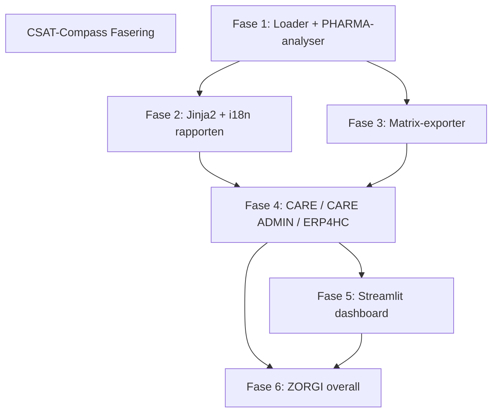

# CSAT-Compass - Implementatiegids

**Versie:** 1.2  
**Laatst bijgewerkt:** 19/03/2026  

**Doel:** Index van alle implementatiefasen met status en verwijzingen  
**Type:** Guide  
**Auteur:** Danny Depecker + GHC  
**Status:** In Progress  

**Bestandsnaam:** implementatie-gids.md  
**Path:** docs/02-tactisch/  

---

## Overzicht fasering

| Fase | Document | Inhoud | T-shirt | Status |
|---|---|---|---|---|
| Fase 1 | [fase1-data-analyse.md](fasen/fase1-data-analyse.md) | Hybride loader + PHARMA-analyser | M | ✅ Compleet |
| Fase 2 | [fase2-rapportage.md](fasen/fase2-rapportage.md) | Jinja2-templates + i18n NL/FR | M | 🔄 In progress |
| Fase 3 | [fase3-matrix.md](fasen/fase3-matrix.md) | Matrix-exporter (5 matrices) | S | ⏳ Gepland |
| Fase 4 | [fase4-pijlers.md](fasen/fase4-pijlers.md) | CARE / CARE ADMIN / ERP4HC | M | ⏳ Gepland |
| Fase 5 | [fase5-dashboard.md](fasen/fase5-dashboard.md) | Streamlit dashboard NL/FR | L | ⏳ Gepland |
| Fase 6 | [fase6-zorgi-overall.md](fasen/fase6-zorgi-overall.md) | ZORGI-aggregatie | S | ⏳ Gepland |

### T-shirt inschatting — toelichting

| Fase | T-shirt | Uurbandbreedte | Redenering |
|---|---|---|---|
| Fase 1 | M | 8–24u | Fundament — 10 bestanden, SQL+CSV loaders, tests, meeste architectuurbeslissingen |
| Fase 2 | M | 8–24u | Nieuw i18n-systeem + Jinja2 templates van nul opzetten |
| Fase 3 | S | 4–8u | Bouwt op Fase 2-infrastructuur, 1 extra exporter + matrix-template |
| Fase 4 | M | 8–24u | 3 pijlers × (config + analyser + tests), repetitief maar elk met eigen categorieën |
| Fase 5 | L | 24–48u | Dashboard altijd meer werk: UX, filtering, plotly charts, NL/FR toggle |
| Fase 6 | S | 4–8u | Aggregatie van bestaande pijlers, geen nieuwe infrastructuur |
| **Totaal** | **XXL** | **56–136u** | Combinatie van M+M+S+M+L+S — zwaarste risico in Fase 5 |

### T-shirt legenda

| Maat  | Uurbandbreedte | Gewicht (t.o.v. XS) |
|-------|----------------|---------------------|
| XS    | 1–4u           | 1×                  |
| S     | 4–8u           | 2×                  |
| M     | 8–24u          | 5×                  |
| L     | 24–48u         | 10×                 |
| XL    | 48–80u         | 20×                 |
| XXL   | 80–120u        | 30×                 |
| XXXL  | >120u          | >40×                |

> 💡 Fase 3 en 6 zijn bewust klein gehouden — ze hergebruiken infrastructuur van eerdere fasen.
> Fase 5 (dashboard) is het grootste risico op scope-uitbreiding: begrens de UX-ambities in Fase 5
> en lever eerst een werkende versie, verfijn daarna.

---

## Afhankelijkheden tussen fasen

---

## Referentiedocumenten

- [Projectplan high-level](../01-strategisch/projectplan-highlevel.md)
- [Architectuurbeslissingen (ADRs)](../01-strategisch/architectuur-beslissingen.md)
- [Operations Runbook](../03-operationeel/operations-runbook.md)

---

## Versiehistorie

| Versie | Datum | Wijzigingen | Auteur |
| ------ | ---------- | ------------------------------------------- | -------------------- |
| 1.0 | 18/03/2026 | Initiële versie — index | Danny Depecker + GHC |
| 1.1 | 19/03/2026 | T-shirt schattingen toegevoegd per fase | Danny Depecker + GHC |
| 1.2 | 19/03/2026 | T-shirt tabellen herzien: Punten vervangen door uurbandbreedte + gewicht t.o.v. XS | Danny Depecker + GHC |
