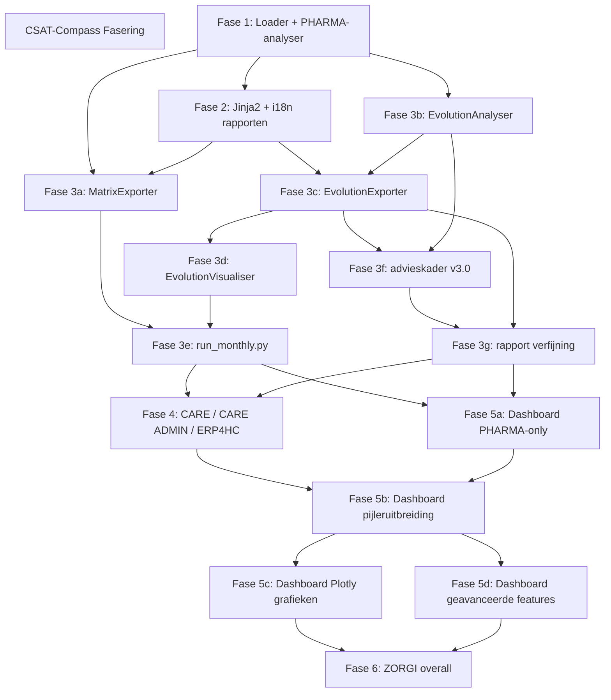

# CSAT-Compass - Implementatiegids

**Versie:** 2.9
**Laatst bijgewerkt:** 19/04/2026

**Doel:** Index van alle implementatiefasen met status en verwijzingen
**Type:** Guide
**Auteur:** Danny Depecker + GHC + Claude Desktop
**Status:** In Progress

**Bestandsnaam:** implementatie-gids.md
**Path:** docs/02-tactisch/

---

## Overzicht fasering

| Fase | Document | Inhoud | T-shirt | Status |
|---|---|---|---|---|
| Fase 1 | [fase1-data-analyse.md](fasen/fase1-data-analyse.md) | Hybride loader + PHARMA-analyser | M | ✅ Compleet |
| Fase 2 | [fase2-rapportage.md](fasen/fase2-rapportage.md) | Jinja2-templates + i18n NL/FR | M | ✅ Compleet |
| Fase 3a | [fase3a-matrix.md](fasen/fase3a-matrix.md) | MatrixExporter — maand/kwartaal/jaar | S | ✅ Compleet |
| Fase 3b | [fase3b-evolutie-analyser.md](fasen/fase3b-evolutie-analyser.md) | EvolutionResult + EvolutionAnalyser | M | ✅ Compleet |
| Fase 3c | [fase3c-evolutie-exporter.md](fasen/fase3c-evolutie-exporter.md) | EvolutionExporter + templates NL/FR | M | ✅ Compleet |
| Fase 3d | [fase3d-evolutie-visualisatie.md](fasen/fase3d-evolutie-visualisatie.md) | Matplotlib 4-subplot + CLI runner | M | ✅ Compleet |
| Fase 3e | [fase3e-run-monthly.md](fasen/fase3e-run-monthly.md) | Maandelijkse batch-runner | S | ✅ Compleet |
| Fase 3f | [fase3f-evolutie-advieskader.md](fasen/fase3f-evolutie-advieskader.md) | Evolutie-advieskader — gap-analyse, 12 beslissingen DDP, release 1 scope | S | ✅ Compleet (v3.0) |
| Fase 3g | [fase3g-evolutie-rapport-verfijning.md](fasen/fase3g-evolutie-rapport-verfijning.md) | Evolutierapport verfijning — implementatie release 1 | M | ✅ Compleet |
| Fase 5a | [fase5a-streamlit-dashboard.md](fasen/fase5a-streamlit-dashboard.md) | Streamlit dashboard PHARMA-only — app.py, dashboard_exporter.py, KPI-kaarten, NL/FR toggle | L | ✅ Afgerond |
| **Fase 4** | [fase4-pijlers.md](fasen/fase4-pijlers.md) | CARE / CARE ADMIN / ERP4HC pijleranalysers | M | 🔄 Volgende |
| Fase 5b | [fase5b-dashboard-ui-verfijning.md](fasen/fase5b-dashboard-ui-verfijning.md) | Dashboard UI-verfijning — vaste tabbalk, alle 6 tabbladen volledig uitgewerkt (Tijdlijn, Tickets, Responstijd, Ziekenhuizen, KPI Targets) | M | ✅ Afgerond |
| Fase 5c | [fase5c-tickets-prioriteit-insights.md](fasen/fase5c-tickets-prioriteit-insights.md) | Tickets & Prioriteit — insight-boxes, feedbackthema's, productiezetting | S | ✅ Afgerond |
| Fase 5d | — | Plotly interactieve grafieken — geïntegreerd in Fase 5b/5c | S | ✅ Afgerond (geïntegreerd) |
| Fase 5e | [fase5e → geïntegreerd] | Geavanceerde features — filtering per ziekenhuis (kolomfilters), Export CSV, UI-verfijning | S | ✅ Afgerond |
| **Fase 5** | — | **Dashboard PHARMA volledig afgerond** — alle 6 tabbladen, export CSV, kolomfilters, UI-verfijning | — | ✅ **Volledig afgerond** |
| Fase 6 | `fase6-zorgi-overall.md` | ZORGI-aggregatie — alle pijlers gecombineerd | S | ⏳ Gepland |

> 💡 **Fase 3a–3d** vormen samen de volledige evolutie-rapportage (Option C — standalone, geen externe AI nodig).
> Dit vervangt de voormalige Claude-workflow (`PromptTemplate_CustomerSatisfactionEvolution.md`).
>
> 💡 **Fase 3f** is het normatieve advieskader (v3.0 — samenvoeging CD + GHC advies, alle 12 DDP-beslissingen).
> De oorspronkelijke GHC-versie is gearchiveerd in `archive/analyse_3f/fase3f-evolutie-advieskader_ghc.md`.
>
> 💡 **Fase 5 volledig afgerond (19/04/2026)** — PHARMA-dashboard operationeel voor CEO Eric + COO Christian.
> Fase 4 is de logische volgende stap: pijler-agnostische architectuur laat CARE / CARE ADMIN / ERP4HC
> toe als flip-the-switch uitbreiding. Vereiste info (SD-nummers, categorieën) eerst opvragen bij het team.
> Volledig handover-document: `WIP/handover-fase5a-2026-03-31.md`.

---

### T-shirt inschatting — toelichting

| Fase | T-shirt | Uurbandbreedte | Redenering |
|---|---|---|---|
| Fase 1 | M | 8–24u | Fundament — 10 bestanden, SQL+CSV loaders, tests, meeste architectuurbeslissingen |
| Fase 2 | M | 8–24u | Nieuw i18n-systeem + Jinja2 templates van nul opzetten |
| Fase 3a | S | 4–8u | MatrixExporter — bouwt op Fase 2-infrastructuur |
| Fase 3b | M | 8–24u | EvolutionResult dataclass + EvolutionAnalyser (issue_type, priority, responstijd, hospitals, thema's) |
| Fase 3c | M | 8–24u | EvolutionExporter + 11 template-secties + conditionele narratieve blokken NL/FR |
| Fase 3d | M | 8–24u | Matplotlib 4-subplot visualisatie + generate_evolution.py CLI runner |
| Fase 3e | S | 4–8u | Batch-runner run_monthly.py — combineert matrix + evolutie + charts |
| Fase 3f | S | 4–8u | Evolutie-advieskader — gap-analyse, beslisrecord, release 1 scope en acceptatiecriteria |
| Fase 3g | M | 8–24u | Evolutierapport verfijning — metrics, InsightsGenerator (gedeeld), templates en validatie |
| Fase 5a | S | 4–8u | Dashboard PHARMA-only — volledige infrastructuur herbruikbaar (loaders, analysers, i18n, theme) |
| Fase 4 | M | 8–24u | 3 pijlers (config + analyser + tests), repetitief maar elk met eigen categorieën |
| Fase 5b | M | 8–24u | Dashboard UI-verfijning — vaste tabbalk, alle tabbladen, Plotly grafieken, insights |
| Fase 5c | S | 4–8u | Tickets & Prioriteit — insight-boxes, feedbackthema's, productiezetting |
| Fase 5d | S | 4–8u | Plotly grafieken — geïntegreerd in 5b/5c |
| Fase 5e | S | 4–8u | Export CSV, kolomfilters, UI-verfijning — geïntegreerd in 5b/5c/5d |
| Fase 6 | S | 4–8u | Aggregatie van bestaande pijlers, geen nieuwe infrastructuur |
| **Totaal** | **XXXL** | **108–224u** | Combinatie van M+M+S+M+M+M+S+S+M+S+M+S+S+S+S+S |

### T-shirt legenda

| Maat  | Uurbandbreedte | Gewicht (t.o.v. XS) |
|-------|----------------|---------------------|
| XS    | 1–4u           | 1×                  |
| S     | 4–8u           | 2×                  |
| M     | 8–24u          | 5×                  |
| L     | 24–48u         | 10×                 |
| XL    | 48–80u         | 20×                 |
| XXL   | 80–120u        | 30×                 |
| XXXL  | >120u          | >40×                |

> 💡 Fase 3d en 6 zijn bewust klein gehouden — ze hergebruiken infrastructuur van eerdere fasen.
> Fase 5 is volledig afgerond (5a–5e). Fase 4 is de volgende prioriteit.

---

## Afhankelijkheden tussen fasen

Het onderstaande diagram toont de build-volgorde en afhankelijkheden.


```mermaid
graph TD
    title[CSAT-Compass Fasering]
    F1[Fase 1: Loader + PHARMA-analyser]
    F2[Fase 2: Jinja2 + i18n rapporten]
    F3a[Fase 3a: MatrixExporter]
    F3b[Fase 3b: EvolutionAnalyser]
    F3c[Fase 3c: EvolutionExporter]
    F3d[Fase 3d: EvolutionVisualiser]
    F3e[Fase 3e: run_monthly.py]
    F3f[Fase 3f: advieskader v3.0]
    F3g[Fase 3g: rapport verfijning]
    F5a[Fase 5a: Dashboard PHARMA-only]
    F4[Fase 4: CARE / CARE ADMIN / ERP4HC]
    F5b[Fase 5b: Dashboard pijleruitbreiding]
    F5c[Fase 5c: Dashboard Plotly grafieken]
    F5d[Fase 5d: Dashboard geavanceerde features]
    F6[Fase 6: ZORGI overall]

    F1 --> F2
    F1 --> F3a
    F2 --> F3a
    F1 --> F3b
    F2 --> F3c
    F3b --> F3c
    F3c --> F3d
    F3a --> F3e
    F3d --> F3e
    F3c --> F3f
    F3b --> F3f
    F3f --> F3g
    F3c --> F3g
    F3e --> F5a
    F3g --> F5a
    F3e --> F4
    F3g --> F4
    F4 --> F5b
    F5a --> F5b
    F5b --> F5c
    F5b --> F5d
    F5c --> F6
    F5d --> F6
```

---

## Kleurarchitectuur — ZORGI Theme-laag

Alle kleuren in CSAT-Compass worden beheerd via een **3-laagse architectuur**.
Dit garandeert dat de golden source (PHARMA-Conventions) nooit rechtstreeks
gewijzigd hoeft te worden en dat hex-waarden op exact één plek gedefinieerd staan.

```text
PHARMA-Conventions/zorgi/zorgi_design_system.md    ← golden source (read-only)
         │
         ▼  (Python-representatie)
src/csat/utils/zorgi_theme.py                      ← pure constanten, geen framework-deps
         │
         ├──► src/csat/utils/branding.py            ← Plotly / Streamlit / matplotlib
         └──► src/csat/core/exporters/              ← visualisatie-modules
                  evolution_visualiser.py              (+ toekomstige dashboards)
```

> Volledige toelichting, regels en tabel met functionele uitbreidingen:
> [`fase3d-evolutie-visualisatie.md §9`](fasen/fase3d-evolutie-visualisatie.md)

---

## Referentiedocumenten

- [Projectplan high-level](../01-strategisch/projectplan-highlevel.md)
- [Architectuurbeslissingen (ADRs)](../01-strategisch/architectuur-beslissingen.md)
- [Operations Runbook](../03-operationeel/operations-runbook.md)

---

## Versiehistorie

| Versie | Datum | Wijzigingen | Auteur |
| ------ | ---------- | ------------------------------------------- | -------------------- |
| 1.0 | 18/03/2026 | Initiële versie — index | Danny Depecker + GHC |
| 1.1 | 19/03/2026 | T-shirt schattingen toegevoegd per fase | Danny Depecker + GHC |
| 1.2 | 19/03/2026 | T-shirt tabellen herzien: uurbandbreedte + gewicht | Danny Depecker + GHC |
| 1.3 | 22/03/2026 | Fase 2 status bijgewerkt naar Compleet | GHC |
| 1.4 | 23/03/2026 | Fase 3 hernoemd naar 3a; sub-fasen 3b/3c/3d toegevoegd (Option C — EvolutionExporter); Mermaid diagram uitgebreid | Danny Depecker + GHC |
| 1.5 | 23/03/2026 | Fase 3b + 3c status bijgewerkt naar Compleet (472 tests, 100% coverage) | GHC |
| 1.6 | 25/03/2026 | Fase 3d status Compleet; kleurarchitectuur sectie toegevoegd (zorgi_theme.py 3-laags) | GHC |
| 1.7 | 26/03/2026 | Fase 3e toegevoegd (run_monthly.py); mermaid diagram bijgewerkt; T-shirt tabel en totaal bijgewerkt | Danny Depecker + GHC |
| 1.8 | 27/03/2026 | Fase 3f toegevoegd (in planning); mermaid diagram + t-shirt tabel bijgewerkt | Danny Depecker + GHC |
| 1.9 | 29/03/2026 | Fase 3f hergedefinieerd als advieskader; implementatiefase doorgeschoven naar 3g; tabellen, afhankelijkheden en totaalinschatting bijgewerkt | Danny Depecker + GHC |
| 2.0 | 29/03/2026 | Fase 3f/3g links gecorrigeerd naar v3.0 in `fasen/` (was: archief GHC-versie); fase 3f beschrijving aangevuld met "12 beslissingen DDP"; noot over samenvoeging CD+GHC toegevoegd | Danny Depecker + CD |
| 2.1 | 31/03/2026 | Sectie "Mapstructuur: scripts / src / tools" toegevoegd (runner/library-patroon, ADR-013) | Danny Depecker + GHC |
| 2.2 | 31/03/2026 | Fase 3g status bijgewerkt naar Compleet (727 tests, 100% coverage, CI stabiel) | Danny Depecker + GHC |
| 2.3 | 01/04/2026 | Fase 3d doc bijgewerkt naar v1.7: subplot 3 prioriteitscompositie, i18n, output-structuur datumsubmap, 61 tests | Danny Depecker + GHC |
| 2.4 | 02/04/2026 | Fase 5 opgesplitst in 5a/5b/5c/5d; fasevolgorde herzien (5a vóór 4 — strategische keuze); Fase 5a status In Progress; Mermaid diagram + T-shirt tabel bijgewerkt | Danny Depecker + GHC |
| 2.5 | 06/04/2026 | Fase 5a link gecorrigeerd naar fase5a-streamlit-dashboard.md; status In uitvoering; T-shirt L (was S) | GHC |
| 2.6 | 10/04/2026 | Fase 5a status → Afgerond; Fase 5b link toegevoegd (fase5b-dashboard-ui-verfijning.md), status In uitvoering, T-shirt M; T-shirt tabel Fase 5b bijgewerkt | Danny Depecker + GHC |
| 2.7 | 18/04/2026 | Fase 5b/5c/5d status → Afgerond; Fase 5d (Plotly) geïntegreerd in 5b/5c; Fase 5e toegevoegd als geavanceerde features ronde 2; fasebeschrijvingen bijgewerkt | Danny Depecker + GHC |
| 2.8 | 19/04/2026 | Fase 5 volledig afgerond — export CSV, kolomfilters, UI-verfijning; samenvattingsregel toegevoegd | Danny Depecker + GHC |
| 2.9 | 19/04/2026 | Fase 4 link toegevoegd (fase4-pijlers.md), status 🔄 Volgende; T-shirt tabel gecorrigeerd (5d/5e); nota's bijgewerkt voor Fase 4 start | Danny Depecker + GHC |
