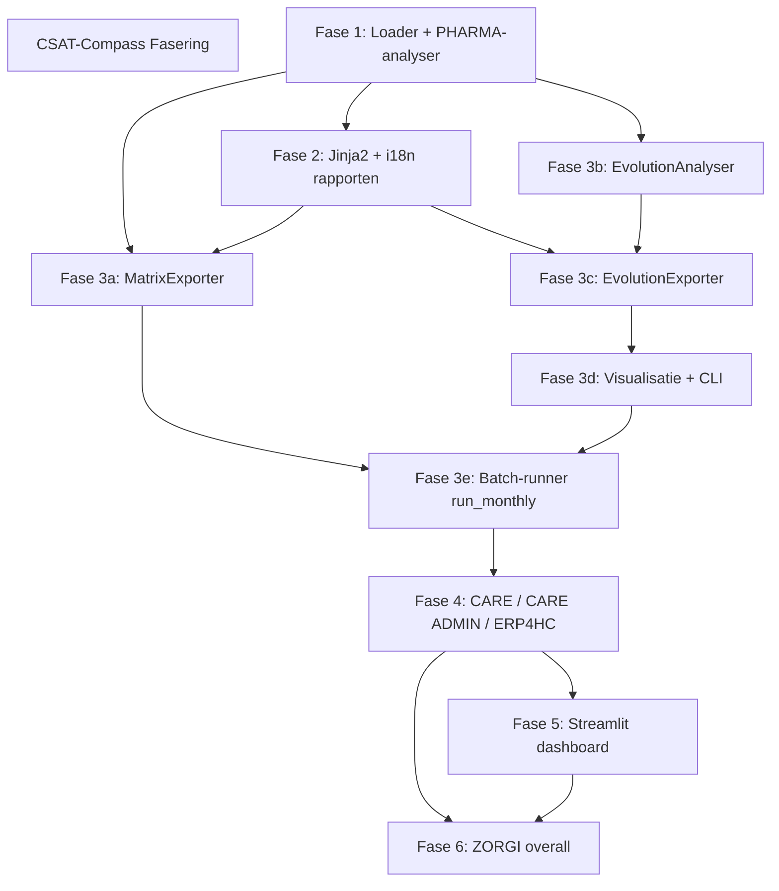

# CSAT-Compass - Implementatiegids

**Versie:** 1.7  
**Laatst bijgewerkt:** 26/03/2026  

**Doel:** Index van alle implementatiefasen met status en verwijzingen  
**Type:** Guide  
**Auteur:** Danny Depecker + GHC  
**Status:** In Progress  

**Bestandsnaam:** implementatie-gids.md  
**Path:** docs/02-tactisch/  

---

## Overzicht fasering

| Fase | Document | Inhoud | T-shirt | Status |
|---|---|---|---|---|
| Fase 1 | [fase1-data-analyse.md](fasen/fase1-data-analyse.md) | Hybride loader + PHARMA-analyser | M | ✅ Compleet |
| Fase 2 | [fase2-rapportage.md](fasen/fase2-rapportage.md) | Jinja2-templates + i18n NL/FR | M | ✅ Compleet |
| Fase 3a | [fase3a-matrix.md](fasen/fase3a-matrix.md) | MatrixExporter — maand/kwartaal/jaar | S | ✅ Compleet |
| Fase 3b | [fase3b-evolutie-analyser.md](fasen/fase3b-evolutie-analyser.md) | EvolutionResult + EvolutionAnalyser | M | ✅ Compleet |
| Fase 3c | [fase3c-evolutie-exporter.md](fasen/fase3c-evolutie-exporter.md) | EvolutionExporter + templates NL/FR | M | ✅ Compleet |
| Fase 3d | [fase3d-evolutie-visualisatie.md](fasen/fase3d-evolutie-visualisatie.md) | Matplotlib 4-subplot + CLI runner | M | ✅ Compleet |
| Fase 3e | [fase3e-run-monthly.md](fasen/fase3e-run-monthly.md) | Maandelijkse batch-runner | S | ✅ Compleet |
| Fase 4 | [fase4-pijlers.md](fasen/fase4-pijlers.md) | CARE / CARE ADMIN / ERP4HC | M | ⏳ Gepland |
| Fase 5 | [fase5-dashboard.md](fasen/fase5-dashboard.md) | Streamlit dashboard NL/FR | L | ⏳ Gepland |
| Fase 6 | [fase6-zorgi-overall.md](fasen/fase6-zorgi-overall.md) | ZORGI-aggregatie | S | ⏳ Gepland |

> 💡 **Fase 3a–3d** vormen samen de volledige evolutie-rapportage (Option C — standalone, geen externe AI nodig).
> Dit vervangt de voormalige Claude-workflow (`PromptTemplate_CustomerSatisfactionEvolution.md`).

---

### T-shirt inschatting — toelichting

| Fase | T-shirt | Uurbandbreedte | Redenering |
|---|---|---|---|
| Fase 1 | M | 8–24u | Fundament — 10 bestanden, SQL+CSV loaders, tests, meeste architectuurbeslissingen |
| Fase 2 | M | 8–24u | Nieuw i18n-systeem + Jinja2 templates van nul opzetten |
| Fase 3a | S | 4–8u | MatrixExporter — bouwt op Fase 2-infrastructuur |
| Fase 3b | M | 8–24u | EvolutionResult dataclass + EvolutionAnalyser (issue_type, priority, responstijd, hospitals, thema's) |
| Fase 3c | M | 8–24u | EvolutionExporter + 11 template-secties + conditionele narratieve blokken NL/FR |
| Fase 3d | M | 8–24u | Matplotlib 4-subplot visualisatie + generate_evolution.py CLI runner |
| Fase 3e | S | 4–8u | Batch-runner run_monthly.py — combineert matrix + evolutie + charts |
| Fase 4 | M | 8–24u | 3 pijlers (config + analyser + tests), repetitief maar elk met eigen categorieën |
| Fase 5 | L | 24–48u | Dashboard altijd meer werk: UX, filtering, plotly charts, NL/FR toggle |
| Fase 6 | S | 4–8u | Aggregatie van bestaande pijlers, geen nieuwe infrastructuur |
| **Totaal** | **XXXL** | **92–192u** | Combinatie van M+M+S+M+M+M+S+M+L+S |

### T-shirt legenda

| Maat  | Uurbandbreedte | Gewicht (t.o.v. XS) |
|-------|----------------|---------------------|
| XS    | 1–4u           | 1×                  |
| S     | 4–8u           | 2×                  |
| M     | 8–24u          | 5×                  |
| L     | 24–48u         | 10×                 |
| XL    | 48–80u         | 20×                 |
| XXL   | 80–120u        | 30×                 |
| XXXL  | >120u          | >40×                |

> 💡 Fase 3d en 6 zijn bewust klein gehouden — ze hergebruiken infrastructuur van eerdere fasen.
> Fase 5 (dashboard) is het grootste risico op scope-uitbreiding.

---

## Afhankelijkheden tussen fasen

Het onderstaande diagram toont de build-volgorde en afhankelijkheden.


```mermaid
graph TD
    title[CSAT-Compass Fasering]
    F1[Fase 1: Loader + PHARMA-analyser]
    F2[Fase 2: Jinja2 + i18n rapporten]
    F3a[Fase 3a: MatrixExporter]
    F3b[Fase 3b: EvolutionAnalyser]
    F3c[Fase 3c: EvolutionExporter]
    F3d[Fase 3d: Visualisatie + CLI]
    F3e[Fase 3e: Batch-runner run_monthly]
    F4[Fase 4: CARE / CARE ADMIN / ERP4HC]
    F5[Fase 5: Streamlit dashboard]
    F6[Fase 6: ZORGI overall]

    F1 --> F2
    F1 --> F3a
    F2 --> F3a
    F1 --> F3b
    F2 --> F3c
    F3b --> F3c
    F3c --> F3d
    F3a --> F3e
    F3d --> F3e
    F3e --> F4
    F4 --> F5
    F4 --> F6
    F5 --> F6
```

---

## Kleurarchitectuur — ZORGI Theme-laag

Alle kleuren in CSAT-Compass worden beheerd via een **3-laagse architectuur**.
Dit garandeert dat de golden source (PHARMA-Conventions) nooit rechtstreeks
gewijzigd hoeft te worden en dat hex-waarden op exact één plek gedefinieerd staan.

```text
PHARMA-Conventions/zorgi/zorgi_design_system.md    ← golden source (read-only)
         │
         ▼  (Python-representatie)
src/csat/utils/zorgi_theme.py                      ← pure constanten, geen framework-deps
         │
         ├──► src/csat/utils/branding.py            ← Plotly / Streamlit / matplotlib
         └──► src/csat/core/exporters/              ← visualisatie-modules
                  evolution_visualiser.py              (+ toekomstige dashboards)
```

> Volledige toelichting, regels en tabel met functionele uitbreidingen:
> [`fase3d-evolutie-visualisatie.md §9`](fasen/fase3d-evolutie-visualisatie.md)

---

## Referentiedocumenten

- [Projectplan high-level](../01-strategisch/projectplan-highlevel.md)
- [Architectuurbeslissingen (ADRs)](../01-strategisch/architectuur-beslissingen.md)
- [Operations Runbook](../03-operationeel/operations-runbook.md)

---

## Versiehistorie

| Versie | Datum | Wijzigingen | Auteur |
| ------ | ---------- | ------------------------------------------- | -------------------- |
| 1.0 | 18/03/2026 | Initiële versie — index | Danny Depecker + GHC |
| 1.1 | 19/03/2026 | T-shirt schattingen toegevoegd per fase | Danny Depecker + GHC |
| 1.2 | 19/03/2026 | T-shirt tabellen herzien: uurbandbreedte + gewicht | Danny Depecker + GHC |
| 1.3 | 22/03/2026 | Fase 2 status bijgewerkt naar Compleet | GHC |
| 1.4 | 23/03/2026 | Fase 3 hernoemd naar 3a; sub-fasen 3b/3c/3d toegevoegd (Option C — EvolutionExporter); Mermaid diagram uitgebreid | Danny Depecker + GHC |
| 1.5 | 23/03/2026 | Fase 3b + 3c status bijgewerkt naar Compleet (472 tests, 100% coverage) | GHC |
| 1.6 | 25/03/2026 | Fase 3d status Compleet; kleurarchitectuur sectie toegevoegd (zorgi_theme.py 3-laags) | Danny Depecker + GHC |
| 1.7 | 26/03/2026 | Fase 3e toegevoegd (run_monthly.py); mermaid diagram bijgewerkt; T-shirt tabel en totaal bijgewerkt | Danny Depecker + GHC |
